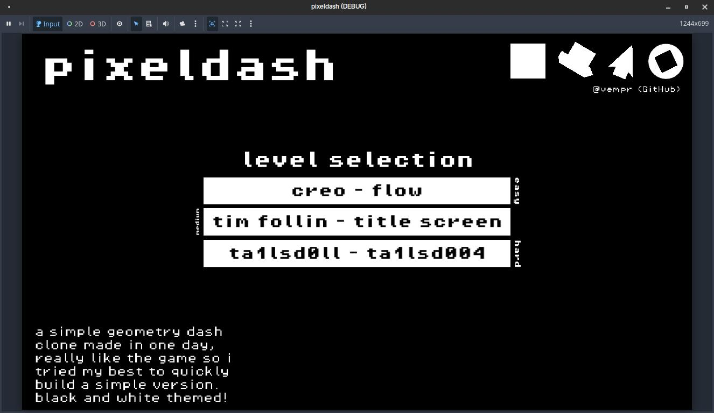
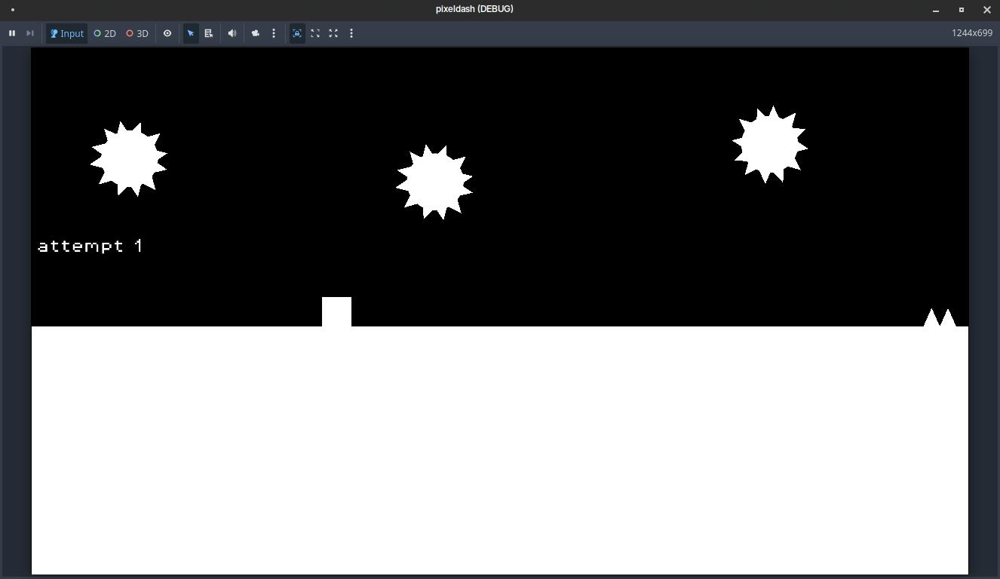
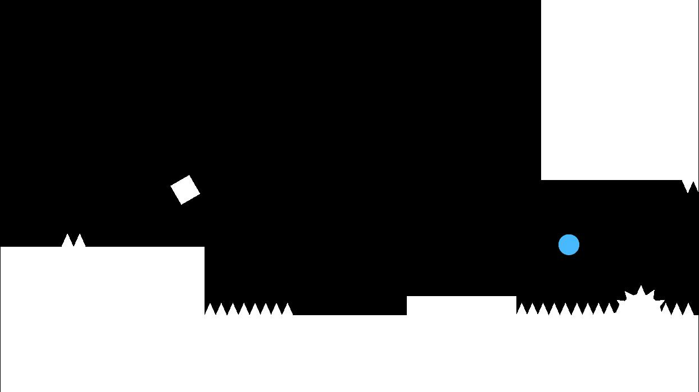
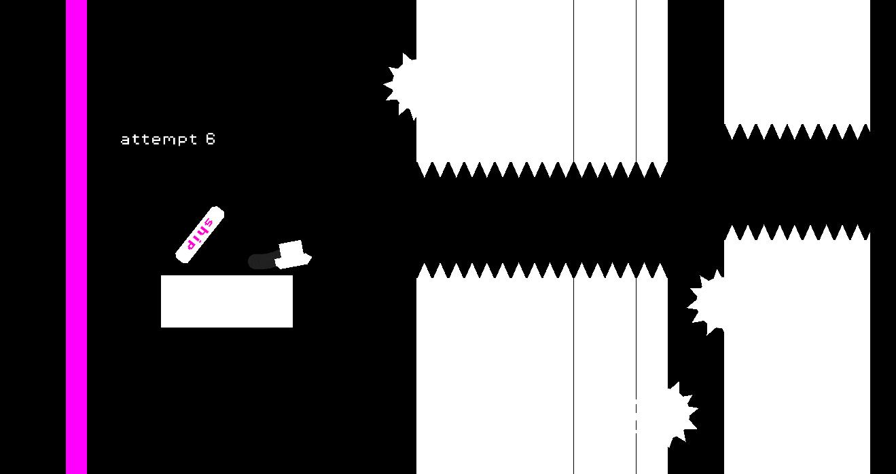

# pixeldash

a simple geometry dash clone made in one day, really like the game so i tried my best to quickly build a simple version.
built in 10 hours for my final Siege submission!

jump with W, ↑, ␣, or LMB.

## gallery

## Credits
- Font: PixelOperator
- Songs:
	- Menu: https://soundcloud.com/randomept-sg/geometry-dash-menu-loop-remastered
	- 1: https://www.youtube.com/watch?v=MM87r7GjzW8
	- 2: https://www.youtube.com/watch?v=SJwh3erQlyE
	- 3: https://soundcloud.com/ta1lsd0ll/everything-is-haunted
